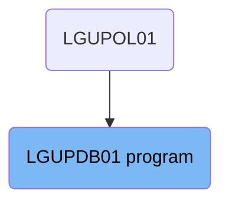
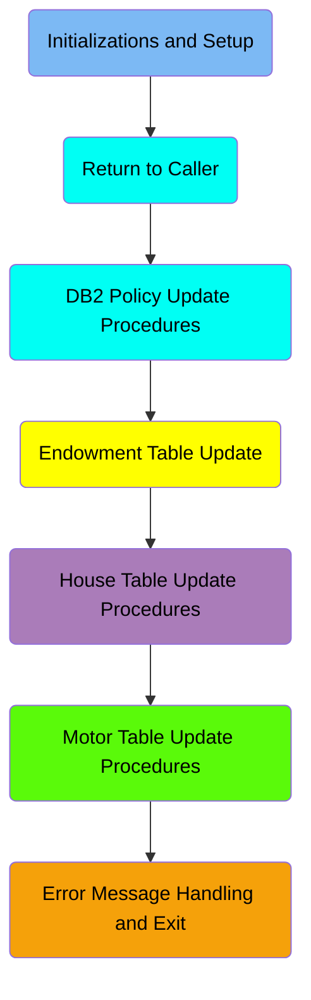
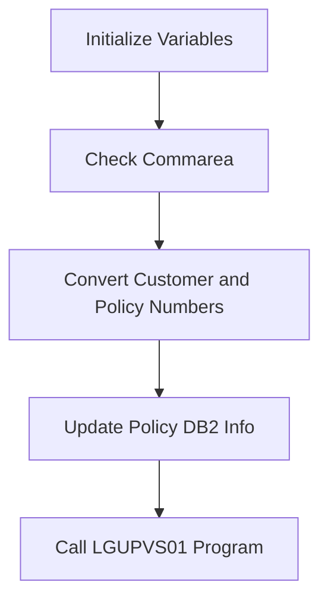
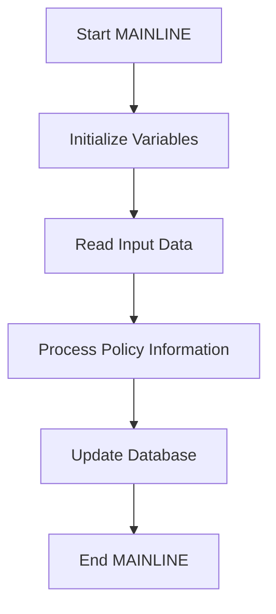
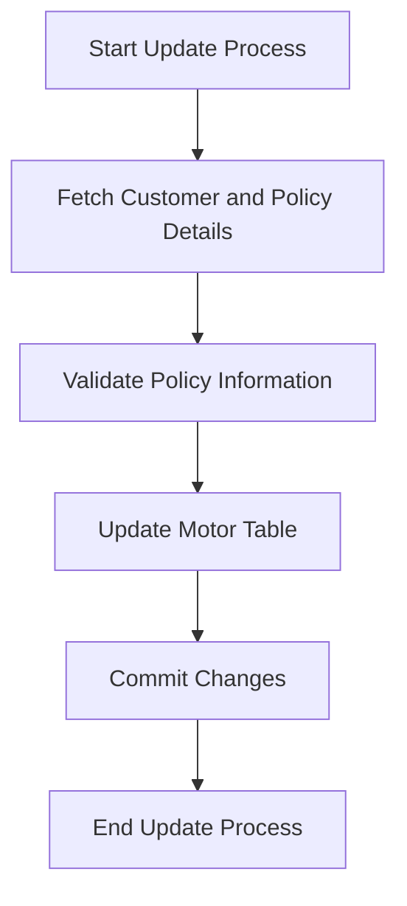
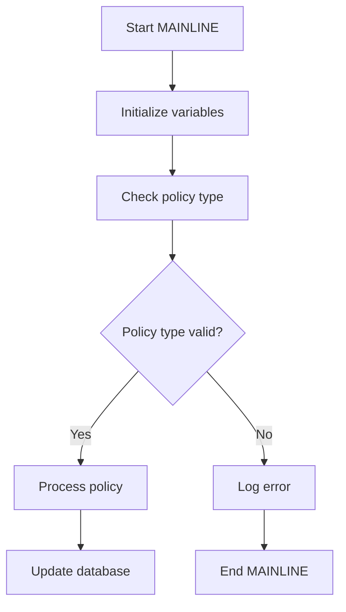

The <SwmToken path="base/src/lgupdb01.cbl" pos="10:6:6" line-data="       PROGRAM-ID. LGUPDB01.">`LGUPDB01`</SwmToken> program is responsible for updating policy information in the IBM Db2 database. This program ensures that policy data is accurately updated by performing several key operations, including initializing variables, checking the communication area, converting customer and policy numbers, and updating the database tables. The program ID for this document is <SwmToken path="base/src/lgupdb01.cbl" pos="10:6:6" line-data="       PROGRAM-ID. LGUPDB01.">`LGUPDB01`</SwmToken>.

The <SwmToken path="base/src/lgupdb01.cbl" pos="10:6:6" line-data="       PROGRAM-ID. LGUPDB01.">`LGUPDB01`</SwmToken> program starts by initializing necessary variables and checking if the communication area is received. It then converts customer and policy numbers to the appropriate format for <SwmToken path="base/src/lgupdb01.cbl" pos="175:5:5" line-data="      * initialize DB2 host variables">`DB2`</SwmToken> operations. The program proceeds to update the policy information in the <SwmToken path="base/src/lgupdb01.cbl" pos="175:5:5" line-data="      * initialize DB2 host variables">`DB2`</SwmToken> database and calls another program, <SwmToken path="base/src/lgupdb01.cbl" pos="209:9:9" line-data="           EXEC CICS LINK Program(LGUPVS01)">`LGUPVS01`</SwmToken>, to update policy records in a VSAM KSDS file. Finally, it returns control to the CICS environment and exits cleanly.

# Where is this program used?

This program is used once, in a flow starting from `LGUPOL01` as represented in the following diagram:



Here is a high level diagram of the program:



# Initializations and Setup



<SwmSnippet path="/base/src/lgupdb01.cbl" line="167">

---

## Initializing Variables

First, the program initializes working storage variables and <SwmToken path="base/src/lgupdb01.cbl" pos="175:5:5" line-data="      * initialize DB2 host variables">`DB2`</SwmToken> host variables. This ensures that all necessary variables are set up correctly before proceeding with further operations.

```cobol
      * initialize working storage variables
           INITIALIZE WS-HEADER.
      * set up general variable
           MOVE EIBTRNID TO WS-TRANSID.
           MOVE EIBTRMID TO WS-TERMID.
           MOVE EIBTASKN TO WS-TASKNUM.
           MOVE SPACES   TO WS-RETRY.
      *----------------------------------------------------------------*
      * initialize DB2 host variables
           INITIALIZE DB2-POLICY.
           INITIALIZE DB2-IN-INTEGERS.

```

---

</SwmSnippet>

<SwmSnippet path="/base/src/lgupdb01.cbl" line="182">

---

## Checking Commarea

Next, the program checks if the commarea (communication area) is received. If no commarea is received, it issues an ABEND (abnormal end) to terminate the program. This step is crucial to ensure that the necessary data is available for processing.

```cobol
      * If NO commarea received issue an ABEND
           IF EIBCALEN IS EQUAL TO ZERO
               MOVE ' NO COMMAREA RECEIVED' TO EM-VARIABLE
               PERFORM WRITE-ERROR-MESSAGE
               EXEC CICS ABEND ABCODE('LGCA') NODUMP END-EXEC
           END-IF
```

---

</SwmSnippet>

<SwmSnippet path="/base/src/lgupdb01.cbl" line="194">

---

## Converting Customer and Policy Numbers

Then, the program converts the customer and policy numbers from the commarea to <SwmToken path="base/src/lgupdb01.cbl" pos="194:17:17" line-data="      * Convert commarea customer &amp; policy nums to DB2 integer format">`DB2`</SwmToken> integer format. This conversion is necessary for the subsequent database operations.

```cobol
      * Convert commarea customer & policy nums to DB2 integer format
           MOVE CA-CUSTOMER-NUM TO DB2-CUSTOMERNUM-INT
           MOVE CA-POLICY-NUM   TO DB2-POLICYNUM-INT
      * and save in error msg field incase required
           MOVE CA-CUSTOMER-NUM TO EM-CUSNUM
           MOVE CA-POLICY-NUM   TO EM-POLNUM
```

---

</SwmSnippet>

<SwmSnippet path="/base/src/lgupdb01.cbl" line="206">

---

## Updating Policy <SwmToken path="base/src/lgupdb01.cbl" pos="207:7:7" line-data="           PERFORM UPDATE-POLICY-DB2-INFO.">`DB2`</SwmToken> Info

Moving to the next step, the program calls the <SwmToken path="base/src/lgupdb01.cbl" pos="207:3:9" line-data="           PERFORM UPDATE-POLICY-DB2-INFO.">`UPDATE-POLICY-DB2-INFO`</SwmToken> procedure to update the required tables in the <SwmToken path="base/src/lgupdb01.cbl" pos="207:7:7" line-data="           PERFORM UPDATE-POLICY-DB2-INFO.">`DB2`</SwmToken> database. This step ensures that the policy information is updated in the database.

```cobol
      *    Call procedure to update required tables
           PERFORM UPDATE-POLICY-DB2-INFO.
```

---

</SwmSnippet>

<SwmSnippet path="/base/src/lgupdb01.cbl" line="209">

---

## Calling <SwmToken path="base/src/lgupdb01.cbl" pos="209:9:9" line-data="           EXEC CICS LINK Program(LGUPVS01)">`LGUPVS01`</SwmToken> Program

Finally, the program calls the <SwmToken path="base/src/lgupdb01.cbl" pos="209:9:9" line-data="           EXEC CICS LINK Program(LGUPVS01)">`LGUPVS01`</SwmToken> program to update policy records stored in a VSAM KSDS file. This step completes the update process by ensuring that the policy records are updated in the VSAM file as well.

More about <SwmToken path="base/src/lgupdb01.cbl" pos="209:9:9" line-data="           EXEC CICS LINK Program(LGUPVS01)">`LGUPVS01`</SwmToken>: <SwmLink doc-title="Updating Policy Records (LGUPVS01)">[Updating Policy Records (LGUPVS01)](/.swm/updating-policy-records-lgupvs01.11l04vtv.sw.md)</SwmLink>

```cobol
           EXEC CICS LINK Program(LGUPVS01)
                Commarea(DFHCOMMAREA)
                LENGTH(225)
           END-EXEC.
```

---

</SwmSnippet>

# Return to Caller

<SwmSnippet path="/base/src/lgupdb01.cbl" line="216">

---

## Returning control to CICS

First, the <SwmToken path="base/src/lgupdb01.cbl" pos="216:1:5" line-data="           EXEC CICS RETURN END-EXEC.">`EXEC CICS RETURN`</SwmToken> command is used to return control to the CICS environment after the mainline processing is complete. This ensures that the transaction is properly terminated and control is handed back to CICS for further processing or to await the next transaction.

```cobol
           EXEC CICS RETURN END-EXEC.
```

---

</SwmSnippet>

<SwmSnippet path="/base/src/lgupdb01.cbl" line="218">

---

## Exiting the program

Next, the <SwmToken path="base/src/lgupdb01.cbl" pos="218:1:3" line-data="       MAINLINE-EXIT.">`MAINLINE-EXIT`</SwmToken> and <SwmToken path="base/src/lgupdb01.cbl" pos="218:3:3" line-data="       MAINLINE-EXIT.">`EXIT`</SwmToken> statements are used to ensure that the program exits cleanly. This marks the end of the program's execution and ensures that all resources are properly released.

```cobol
       MAINLINE-EXIT.
           EXIT.
```

---

</SwmSnippet>

## Interim Summary

So far, we saw the initialization and setup steps, including variable initialization, commarea checking, customer and policy number conversion, <SwmToken path="base/src/lgupdb01.cbl" pos="175:5:5" line-data="      * initialize DB2 host variables">`DB2`</SwmToken> policy info update, and calling the <SwmToken path="base/src/lgupdb01.cbl" pos="209:9:9" line-data="           EXEC CICS LINK Program(LGUPVS01)">`LGUPVS01`</SwmToken> program. These steps ensure that the necessary data is prepared and updated correctly. Now, we will focus on the <SwmToken path="base/src/lgupdb01.cbl" pos="175:5:5" line-data="      * initialize DB2 host variables">`DB2`</SwmToken> policy update procedures, which handle database deadlocks, fetch policy rows, compare timestamps, and update specific policy tables.

# <SwmToken path="base/src/lgupdb01.cbl" pos="175:5:5" line-data="      * initialize DB2 host variables">`DB2`</SwmToken> Policy Update Procedures

<SwmSnippet path="/base/src/lgupdb01.cbl" line="259">

---

## Handling database deadlocks and timeouts

First, the code evaluates the <SwmToken path="base/src/lgupdb01.cbl" pos="259:3:3" line-data="           Evaluate SQLCODE">`SQLCODE`</SwmToken> to determine if there is a deadlock or timeout in the database. If <SwmToken path="base/src/lgupdb01.cbl" pos="259:3:3" line-data="           Evaluate SQLCODE">`SQLCODE`</SwmToken> is -913, it indicates a deadlock or timeout, and the flow moves to handle this scenario by setting the return code to '90', writing an error message, and returning control to CICS.

```cobol
           Evaluate SQLCODE
             When 0
               MOVE '00' TO CA-RETURN-CODE
             When -913
               MOVE '90' TO CA-RETURN-CODE
               PERFORM WRITE-ERROR-MESSAGE
               EXEC CICS RETURN END-EXEC
             When Other
               MOVE '90' TO CA-RETURN-CODE
               PERFORM WRITE-ERROR-MESSAGE
               EXEC CICS RETURN END-EXEC
           END-Evaluate.
```

---

</SwmSnippet>

<SwmSnippet path="/base/src/lgupdb01.cbl" line="272">

---

## Fetching the policy row

Next, the code performs the <SwmToken path="base/src/lgupdb01.cbl" pos="273:3:9" line-data="           PERFORM FETCH-DB2-POLICY-ROW">`FETCH-DB2-POLICY-ROW`</SwmToken> to fetch the first row from the policy table. This step is crucial as it retrieves the policy data that will be updated.

```cobol
      *    Fetch the first row (we only expect one matching row)
           PERFORM FETCH-DB2-POLICY-ROW

```

---

</SwmSnippet>

<SwmSnippet path="/base/src/lgupdb01.cbl" line="275">

---

## Comparing timestamps

Then, the code compares the timestamp in the communication area (<SwmToken path="base/src/lgupdb01.cbl" pos="278:3:5" line-data="             IF CA-LASTCHANGED EQUAL TO DB2-LASTCHANGED">`CA-LASTCHANGED`</SwmToken>) with the timestamp in the database (<SwmToken path="base/src/lgupdb01.cbl" pos="278:11:13" line-data="             IF CA-LASTCHANGED EQUAL TO DB2-LASTCHANGED">`DB2-LASTCHANGED`</SwmToken>). This ensures that the policy data has not been modified by another transaction.

```cobol
           IF SQLCODE = 0
      *      Fetch was successful
      *      Compare timestamp in commarea with that in DB2
             IF CA-LASTCHANGED EQUAL TO DB2-LASTCHANGED
```

---

</SwmSnippet>

<SwmSnippet path="/base/src/lgupdb01.cbl" line="283">

---

## Updating specific policy tables

Moving to the next step, the code evaluates the <SwmToken path="base/src/lgupdb01.cbl" pos="283:3:7" line-data="             EVALUATE CA-REQUEST-ID">`CA-REQUEST-ID`</SwmToken> to determine which specific policy table (Endowment, House, or Motor) needs to be updated. It then performs the corresponding update routine (<SwmToken path="base/src/lgupdb01.cbl" pos="288:3:9" line-data="                 PERFORM UPDATE-ENDOW-DB2-INFO">`UPDATE-ENDOW-DB2-INFO`</SwmToken>, <SwmToken path="base/src/lgupdb01.cbl" pos="293:3:9" line-data="                 PERFORM UPDATE-HOUSE-DB2-INFO">`UPDATE-HOUSE-DB2-INFO`</SwmToken>, or <SwmToken path="base/src/lgupdb01.cbl" pos="298:3:9" line-data="                 PERFORM UPDATE-MOTOR-DB2-INFO">`UPDATE-MOTOR-DB2-INFO`</SwmToken>).

```cobol
             EVALUATE CA-REQUEST-ID

      *** Endowment ***
               WHEN '01UEND'
      *          Call routine to update Endowment table
                 PERFORM UPDATE-ENDOW-DB2-INFO

      *** House ***
               WHEN '01UHOU'
      *          Call routine to update Housetable
                 PERFORM UPDATE-HOUSE-DB2-INFO

      *** Motor ***
               WHEN '01UMOT'
      *          Call routine to update Motor table
                 PERFORM UPDATE-MOTOR-DB2-INFO

```

---

</SwmSnippet>

<SwmSnippet path="/base/src/lgupdb01.cbl" line="310">

---

## Updating the policy table

Finally, the code updates the policy table with the new data from the communication area and sets a new timestamp. This step releases the row lock on the policy table, ensuring data consistency.

```cobol
      *        Now update Policy table and set new timestamp           *
      *----------------------------------------------------------------*
      *        Move numeric commarea fields to integer format
               MOVE CA-BROKERID      TO DB2-BROKERID-INT
               MOVE CA-PAYMENT       TO DB2-PAYMENT-INT

      *        Update policy table details
               MOVE ' UPDATE POLICY  ' TO EM-SQLREQ
               EXEC SQL
                 UPDATE POLICY
                   SET ISSUEDATE        = :CA-ISSUE-DATE,
                       EXPIRYDATE       = :CA-EXPIRY-DATE,
                       LASTCHANGED      = CURRENT TIMESTAMP ,
                       BROKERID         = :DB2-BROKERID-INT,
                       BROKERSREFERENCE = :CA-BROKERSREF
                   WHERE CURRENT OF POLICY_CURSOR
               END-EXEC
```

---

</SwmSnippet>

# Endowment Table Update



<SwmSnippet path="/base/src/lgupdb01.cbl" line="382">

---

## Processing Policy Information

First, the MAINLINE function initializes necessary variables and reads input data. This step ensures that all required data is available for processing policy information.

```cobol

      *================================================================*
      * Update row in Endowment table which matches customer and       *
      * policy number requested.                                       *
      *================================================================*
       UPDATE-ENDOW-DB2-INFO.

      *    Move numeric commarea fields to DB2 Integer formats
           MOVE CA-E-TERM        TO DB2-E-TERM-SINT
           MOVE CA-E-SUM-ASSURED TO DB2-E-SUMASSURED-INT

           MOVE ' UPDATE ENDOW ' TO EM-SQLREQ
           EXEC SQL
             UPDATE ENDOWMENT
               SET
                 WITHPROFITS   = :CA-E-WITH-PROFITS,
```

---

</SwmSnippet>

<SwmSnippet path="/base/src/lgupdb01.cbl" line="382">

---

## Updating Database

Next, the function processes the policy information and updates the database accordingly. This step involves inserting, querying, and deleting policy information stored in the IBM Db2 database.

```cobol

      *================================================================*
      * Update row in Endowment table which matches customer and       *
      * policy number requested.                                       *
      *================================================================*
       UPDATE-ENDOW-DB2-INFO.

      *    Move numeric commarea fields to DB2 Integer formats
           MOVE CA-E-TERM        TO DB2-E-TERM-SINT
           MOVE CA-E-SUM-ASSURED TO DB2-E-SUMASSURED-INT

           MOVE ' UPDATE ENDOW ' TO EM-SQLREQ
           EXEC SQL
             UPDATE ENDOWMENT
               SET
                 WITHPROFITS   = :CA-E-WITH-PROFITS,
```

---

</SwmSnippet>

# House Table Update Procedures

```mermaid
graph TD
  A[Start Update House] --> B[Move CA-H-BEDROOMS to DB2-H-BEDROOMS-SINT]
  B --> C[Move CA-H-VALUE to DB2-H-VALUE-INT]
  C --> D[Prepare SQL Update Statement]
  D --> E[Execute SQL Update Statement]
  E --> F{SQLCODE = 0?}
  F -- Yes --> G[Update Successful]
  F -- No --> H{SQLCODE = 100?}
  H -- Yes --> I[Set CA-RETURN-CODE to '01']
  H -- No --> J[Set CA-RETURN-CODE to '90']
  J --> K[Perform WRITE-ERROR-MESSAGE]

%% Swimm:
%% graph TD
%%   A[Start Update House] --> B[Move <SwmToken path="base/src/lgupdb01.cbl" pos="427:3:7" line-data="           MOVE CA-H-BEDROOMS    TO DB2-H-BEDROOMS-SINT">`CA-H-BEDROOMS`</SwmToken> to DB2-H-BEDROOMS-SINT]
%%   B --> C[Move <SwmToken path="base/src/lgupdb01.cbl" pos="428:3:7" line-data="           MOVE CA-H-VALUE       TO DB2-H-VALUE-INT">`CA-H-VALUE`</SwmToken> to DB2-H-VALUE-INT]
%%   C --> D[Prepare SQL Update Statement]
%%   D --> E[Execute SQL Update Statement]
%%   E --> F{SQLCODE = 0?}
%%   F -- Yes --> G[Update Successful]
%%   F -- No --> H{SQLCODE = 100?}
%%   H -- Yes --> I[Set <SwmToken path="base/src/lgupdb01.cbl" pos="261:9:13" line-data="               MOVE &#39;00&#39; TO CA-RETURN-CODE">`CA-RETURN-CODE`</SwmToken> to '01']
%%   H -- No --> J[Set <SwmToken path="base/src/lgupdb01.cbl" pos="261:9:13" line-data="               MOVE &#39;00&#39; TO CA-RETURN-CODE">`CA-RETURN-CODE`</SwmToken> to '90']
%%   J --> K[Perform WRITE-ERROR-MESSAGE]
```



<SwmSnippet path="/base/src/lgupdb01.cbl" line="427">

---

## Moving to <SwmToken path="base/src/lgupdb01.cbl" pos="427:11:11" line-data="           MOVE CA-H-BEDROOMS    TO DB2-H-BEDROOMS-SINT">`DB2`</SwmToken> Integer Formats

First, the numeric fields from the communication area (<SwmToken path="base/src/lgupdb01.cbl" pos="427:3:7" line-data="           MOVE CA-H-BEDROOMS    TO DB2-H-BEDROOMS-SINT">`CA-H-BEDROOMS`</SwmToken> and <SwmToken path="base/src/lgupdb01.cbl" pos="428:3:7" line-data="           MOVE CA-H-VALUE       TO DB2-H-VALUE-INT">`CA-H-VALUE`</SwmToken>) are moved to their respective <SwmToken path="base/src/lgupdb01.cbl" pos="427:11:11" line-data="           MOVE CA-H-BEDROOMS    TO DB2-H-BEDROOMS-SINT">`DB2`</SwmToken> integer formats (<SwmToken path="base/src/lgupdb01.cbl" pos="427:11:17" line-data="           MOVE CA-H-BEDROOMS    TO DB2-H-BEDROOMS-SINT">`DB2-H-BEDROOMS-SINT`</SwmToken> and <SwmToken path="base/src/lgupdb01.cbl" pos="428:11:17" line-data="           MOVE CA-H-VALUE       TO DB2-H-VALUE-INT">`DB2-H-VALUE-INT`</SwmToken>). This ensures that the data is in the correct format for the database update.

```cobol
           MOVE CA-H-BEDROOMS    TO DB2-H-BEDROOMS-SINT
           MOVE CA-H-VALUE       TO DB2-H-VALUE-INT
```

---

</SwmSnippet>

<SwmSnippet path="/base/src/lgupdb01.cbl" line="430">

---

## Preparing the SQL Update Statement

Next, the SQL update statement is prepared by moving the SQL command into <SwmToken path="base/src/lgupdb01.cbl" pos="430:13:15" line-data="           MOVE &#39; UPDATE HOUSE &#39; TO EM-SQLREQ">`EM-SQLREQ`</SwmToken>. This sets up the command to update the house details in the database.

```cobol
           MOVE ' UPDATE HOUSE ' TO EM-SQLREQ
           EXEC SQL
             UPDATE HOUSE
```

---

</SwmSnippet>

<SwmSnippet path="/base/src/lgupdb01.cbl" line="433">

---

## Executing the SQL Update Statement

Then, the SQL update statement is executed. The fields such as <SwmToken path="base/src/lgupdb01.cbl" pos="434:1:1" line-data="                    PROPERTYTYPE = :CA-H-PROPERTY-TYPE,">`PROPERTYTYPE`</SwmToken>, <SwmToken path="base/src/lgupdb01.cbl" pos="435:1:1" line-data="                    BEDROOMS     = :DB2-H-BEDROOMS-SINT,">`BEDROOMS`</SwmToken>, <SwmToken path="base/src/lgupdb01.cbl" pos="436:1:1" line-data="                    VALUE        = :DB2-H-VALUE-INT,">`VALUE`</SwmToken>, <SwmToken path="base/src/lgupdb01.cbl" pos="437:1:1" line-data="                    HOUSENAME    = :CA-H-HOUSE-NAME,">`HOUSENAME`</SwmToken>, <SwmToken path="base/src/lgupdb01.cbl" pos="438:1:1" line-data="                    HOUSENUMBER  = :CA-H-HOUSE-NUMBER,">`HOUSENUMBER`</SwmToken>, and <SwmToken path="base/src/lgupdb01.cbl" pos="439:1:1" line-data="                    POSTCODE     = :CA-H-POSTCODE">`POSTCODE`</SwmToken> are updated where the <SwmToken path="base/src/lgupdb01.cbl" pos="441:1:1" line-data="                    POLICYNUMBER = :DB2-POLICYNUM-INT">`POLICYNUMBER`</SwmToken> matches the provided value. This updates the house details in the database.

```cobol
               SET
                    PROPERTYTYPE = :CA-H-PROPERTY-TYPE,
                    BEDROOMS     = :DB2-H-BEDROOMS-SINT,
                    VALUE        = :DB2-H-VALUE-INT,
                    HOUSENAME    = :CA-H-HOUSE-NAME,
                    HOUSENUMBER  = :CA-H-HOUSE-NUMBER,
                    POSTCODE     = :CA-H-POSTCODE
               WHERE
                    POLICYNUMBER = :DB2-POLICYNUM-INT
           END-EXEC
```

---

</SwmSnippet>

<SwmSnippet path="/base/src/lgupdb01.cbl" line="444">

---

## Handling SQLCODE

If the <SwmToken path="base/src/lgupdb01.cbl" pos="444:3:3" line-data="           IF SQLCODE NOT EQUAL 0">`SQLCODE`</SwmToken> is not equal to 0, it indicates an error. If <SwmToken path="base/src/lgupdb01.cbl" pos="444:3:3" line-data="           IF SQLCODE NOT EQUAL 0">`SQLCODE`</SwmToken> is 100, it means no rows were found to update, and <SwmToken path="base/src/lgupdb01.cbl" pos="447:9:13" line-data="               MOVE &#39;01&#39; TO CA-RETURN-CODE">`CA-RETURN-CODE`</SwmToken> is set to '01'. For other errors, <SwmToken path="base/src/lgupdb01.cbl" pos="447:9:13" line-data="               MOVE &#39;01&#39; TO CA-RETURN-CODE">`CA-RETURN-CODE`</SwmToken> is set to '90', and an error message is written to the TD queue by performing <SwmToken path="base/src/lgupdb01.cbl" pos="451:3:7" line-data="               PERFORM WRITE-ERROR-MESSAGE">`WRITE-ERROR-MESSAGE`</SwmToken>. This ensures proper error handling and logging.

```cobol
           IF SQLCODE NOT EQUAL 0
      *      Non-zero SQLCODE from UPDATE statement
             IF SQLCODE = 100
               MOVE '01' TO CA-RETURN-CODE
             ELSE
               MOVE '90' TO CA-RETURN-CODE
      *        Write error message to TD QUEUE(CSMT)
               PERFORM WRITE-ERROR-MESSAGE
             END-IF
           END-IF.
```

---

</SwmSnippet>

# Motor Table Update Procedures

This is the next section of the flow.



<SwmSnippet path="/base/src/lgupdb01.cbl" line="457">

---

## Fetch Customer and Policy Details

First, we fetch the customer and policy details that match the provided customer and policy number. This ensures that we are updating the correct record in the Motor table.

```cobol
      * Update row in Motor table which matches customer and           *
      * policy number requested.                                       *
      *================================================================*
       UPDATE-MOTOR-DB2-INFO.
```

---

</SwmSnippet>

<SwmSnippet path="/base/src/lgupdb01.cbl" line="461">

---

## Validate Policy Information

Next, we validate the policy information to ensure it meets the necessary criteria for an update. This step is crucial to prevent invalid data from being entered into the database.

```cobol

      *    Move numeric commarea fields to DB2 Integer formats
           MOVE CA-M-CC          TO DB2-M-CC-SINT
           MOVE CA-M-VALUE       TO DB2-M-VALUE-INT
           MOVE CA-M-PREMIUM     TO DB2-M-PREMIUM-INT
           MOVE CA-M-ACCIDENTS   TO DB2-M-ACCIDENTS-INT

           MOVE ' UPDATE MOTOR ' TO EM-SQLREQ
           EXEC SQL
             UPDATE MOTOR
```

---

</SwmSnippet>

<SwmSnippet path="/base/src/lgupdb01.cbl" line="471">

---

## Update Motor Table

Then, we proceed to update the Motor table with the new policy information. This involves executing an SQL update statement to modify the existing record.

```cobol
               SET
                    MAKE              = :CA-M-MAKE,
                    MODEL             = :CA-M-MODEL,
                    VALUE             = :DB2-M-VALUE-INT,
                    REGNUMBER         = :CA-M-REGNUMBER,
                    COLOUR            = :CA-M-COLOUR,
                    CC                = :DB2-M-CC-SINT,
                    YEAROFMANUFACTURE = :CA-M-MANUFACTURED,
                    PREMIUM           = :DB2-M-PREMIUM-INT,
                    ACCIDENTS         = :DB2-M-ACCIDENTS-INT
               WHERE
                    POLICYNUMBER      = :DB2-POLICYNUM-INT
           END-EXEC

           IF SQLCODE NOT EQUAL 0
      *      Non-zero SQLCODE from UPDATE statement
             IF SQLCODE EQUAL 100
               MOVE '01' TO CA-RETURN-CODE
             ELSE
               MOVE '90' TO CA-RETURN-CODE
```

---

</SwmSnippet>

<SwmSnippet path="/base/src/lgupdb01.cbl" line="491">

---

## Commit Changes

After updating the Motor table, we commit the changes to ensure that the update is saved in the database. This step is essential to make the update permanent.

```cobol
      *        Write error message to TD QUEUE(CSMT)
               PERFORM WRITE-ERROR-MESSAGE
             END-IF
           END-IF.
           EXIT.

      *================================================================*
      * Procedure to write error message to Queues                     *
      *   message will include Date, Time, Program Name, Customer      *
      *   Number, Policy Number and SQLCODE.                           *
      *================================================================*
       WRITE-ERROR-MESSAGE.
      * Save SQLCODE in message
           MOVE SQLCODE TO EM-SQLRC
      * Obtain and format current time and date
           EXEC CICS ASKTIME ABSTIME(WS-ABSTIME)
           END-EXEC
           EXEC CICS FORMATTIME ABSTIME(WS-ABSTIME)
                     MMDDYYYY(WS-DATE)
                     TIME(WS-TIME)
```

---

</SwmSnippet>

<SwmSnippet path="/base/src/lgupdb01.cbl" line="511">

---

## End Update Process

Finally, we end the update process by performing any necessary cleanup and logging the update operation. This ensures that the system is ready for the next operation.

```cobol
           END-EXEC
           MOVE WS-DATE TO EM-DATE
           MOVE WS-TIME TO EM-TIME
      * Write output message to TDQ
           EXEC CICS LINK PROGRAM('LGSTSQ')
                     COMMAREA(ERROR-MSG)
                     LENGTH(LENGTH OF ERROR-MSG)
           END-EXEC.
      * Write 90 bytes or as much as we have of commarea to TDQ
           IF EIBCALEN > 0 THEN
             IF EIBCALEN < 91 THEN
               MOVE DFHCOMMAREA(1:EIBCALEN) TO CA-DATA
               EXEC CICS LINK PROGRAM('LGSTSQ')
                         COMMAREA(CA-ERROR-MSG)
                         LENGTH(LENGTH OF CA-ERROR-MSG)
               END-EXEC
             ELSE
               MOVE DFHCOMMAREA(1:90) TO CA-DATA
               EXEC CICS LINK PROGRAM('LGSTSQ')
                         COMMAREA(CA-ERROR-MSG)
                         LENGTH(LENGTH OF CA-ERROR-MSG)
```

---

</SwmSnippet>

# Error Message Handling and Exit

This is the next section of the flow.



<SwmSnippet path="/base/src/lgupdb01.cbl" line="498">

---

## Initializing variables

First, the MAINLINE function initializes necessary variables. This step sets up the environment for processing policy information by ensuring all required variables are ready for use.

```cobol
      * Procedure to write error message to Queues                     *
      *   message will include Date, Time, Program Name, Customer      *
      *   Number, Policy Number and SQLCODE.                           *
      *================================================================*
       WRITE-ERROR-MESSAGE.
      * Save SQLCODE in message
           MOVE SQLCODE TO EM-SQLRC
      * Obtain and format current time and date
```

---

</SwmSnippet>

<SwmSnippet path="/base/src/lgupdb01.cbl" line="506">

---

## Checking policy type

Next, the function checks the type of policy being processed. This is crucial as different policy types may require different handling procedures. The check ensures that the policy type is valid and can be processed further.

```cobol
           EXEC CICS ASKTIME ABSTIME(WS-ABSTIME)
           END-EXEC
           EXEC CICS FORMATTIME ABSTIME(WS-ABSTIME)
                     MMDDYYYY(WS-DATE)
                     TIME(WS-TIME)
           END-EXEC
           MOVE WS-DATE TO EM-DATE
           MOVE WS-TIME TO EM-TIME
      * Write output message to TDQ
           EXEC CICS LINK PROGRAM('LGSTSQ')
```

---

</SwmSnippet>

<SwmSnippet path="/base/src/lgupdb01.cbl" line="516">

---

## Processing policy

Then, if the policy type is valid, the function proceeds to process the policy. This involves applying business logic specific to the policy type, such as calculating premiums or updating policy details.

```cobol
                     COMMAREA(ERROR-MSG)
                     LENGTH(LENGTH OF ERROR-MSG)
           END-EXEC.
      * Write 90 bytes or as much as we have of commarea to TDQ
           IF EIBCALEN > 0 THEN
             IF EIBCALEN < 91 THEN
               MOVE DFHCOMMAREA(1:EIBCALEN) TO CA-DATA
               EXEC CICS LINK PROGRAM('LGSTSQ')
                         COMMAREA(CA-ERROR-MSG)
                         LENGTH(LENGTH OF CA-ERROR-MSG)
```

---

</SwmSnippet>

<SwmSnippet path="/base/src/lgupdb01.cbl" line="526">

---

## Updating database

Finally, the function updates the database with the processed policy information. This step ensures that the changes made during the policy processing are saved and reflected in the database.

```cobol
               END-EXEC
             ELSE
               MOVE DFHCOMMAREA(1:90) TO CA-DATA
               EXEC CICS LINK PROGRAM('LGSTSQ')
                         COMMAREA(CA-ERROR-MSG)
                         LENGTH(LENGTH OF CA-ERROR-MSG)
               END-EXEC
             END-IF
           END-IF.
           EXIT.
```

---

</SwmSnippet>

&nbsp;

*This is an auto-generated document by Swimm 🌊 and has not yet been verified by a human*

<SwmMeta version="3.0.0" repo-id="Z2l0aHViJTNBJTNBa3luZHJ5bC1jaWNzLWdlbmFwcCUzQSUzQVN3aW1tLURlbW8=" repo-name="kyndryl-cics-genapp"><sup>Powered by [Swimm](https://app.swimm.io/)</sup></SwmMeta>
