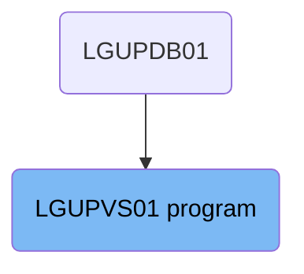
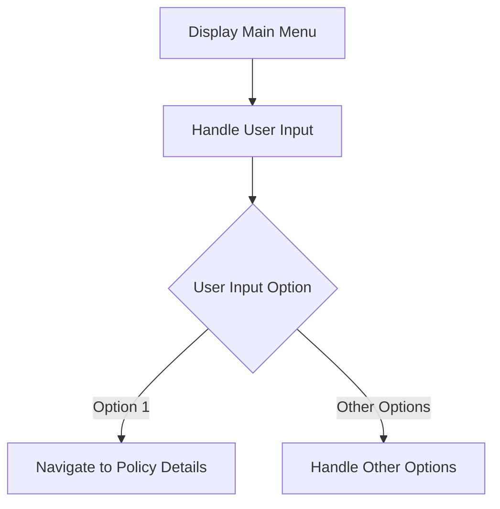

The <SwmToken path="base/src/lgupvs01.cbl" pos="11:6:6" line-data="       PROGRAM-ID. LGUPVS01.">`LGUPVS01`</SwmToken> program is responsible for displaying the main menu to the user, handling user input, and navigating to policy details based on the user's selection. This is achieved through a series of steps that involve sending a map to the user, setting up handlers for user actions, and linking to other programs as needed.

The <SwmToken path="base/src/lgupvs01.cbl" pos="11:6:6" line-data="       PROGRAM-ID. LGUPVS01.">`LGUPVS01`</SwmToken> program first displays the main menu to the user, allowing them to interact with the application. It then handles the user's input by setting up handlers for different actions like CLEAR and PF3. Based on the user's selection, the program navigates to the appropriate section, such as policy details, by linking to other programs and passing the necessary data.

# Where is this program used?

This program is used once, in a flow starting from `LGUPDB01` as represented in the following diagram:



Lets' zoom into the flow:



<SwmSnippet path="/base/src/lgupvs01.cbl" line="199">

---

## Display Main Menu

First, the main menu is displayed to the user using the <SwmToken path="base/src/lgupvs01.cbl" pos="200:1:1" line-data="               EXEC CICS LINK PROGRAM(&#39;LGSTSQ&#39;)">`EXEC`</SwmToken>` `<SwmToken path="base/src/lgupvs01.cbl" pos="200:3:3" line-data="               EXEC CICS LINK PROGRAM(&#39;LGSTSQ&#39;)">`CICS`</SwmToken>` SEND MAP` command. This allows the user to interact with the application and choose an option.

```cobol
               MOVE DFHCOMMAREA(1:90) TO CA-DATA
               EXEC CICS LINK PROGRAM('LGSTSQ')
                         COMMAREA(CA-ERROR-MSG)
                         LENGTH(Length Of CA-ERROR-MSG)
```

---

</SwmSnippet>

<SwmSnippet path="/base/src/lgupvs01.cbl" line="204">

---

## Handle User Input

Next, the application handles user input by setting up handlers for different actions like CLEAR and PF3. This ensures that the application can respond appropriately to user actions.

```cobol
             END-IF
           END-IF.
           EXIT.

```

---

</SwmSnippet>

<SwmSnippet path="/base/src/lgupvs01.cbl" line="211">

---

## Navigate to Policy Details

Then, based on the user input, the application evaluates the option chosen by the user. If the user selects option '1', the application navigates to the policy details by moving relevant data to the communication area and linking to the `LGIPOL01` program.

```cobol

```

---

</SwmSnippet>

&nbsp;

*This is an auto-generated document by Swimm 🌊 and has not yet been verified by a human*

<SwmMeta version="3.0.0" repo-id="Z2l0aHViJTNBJTNBa3luZHJ5bC1jaWNzLWdlbmFwcCUzQSUzQVN3aW1tLURlbW8=" repo-name="kyndryl-cics-genapp"><sup>Powered by [Swimm](https://app.swimm.io/)</sup></SwmMeta>
