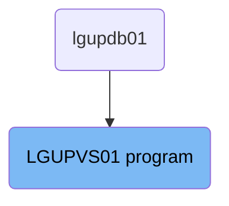
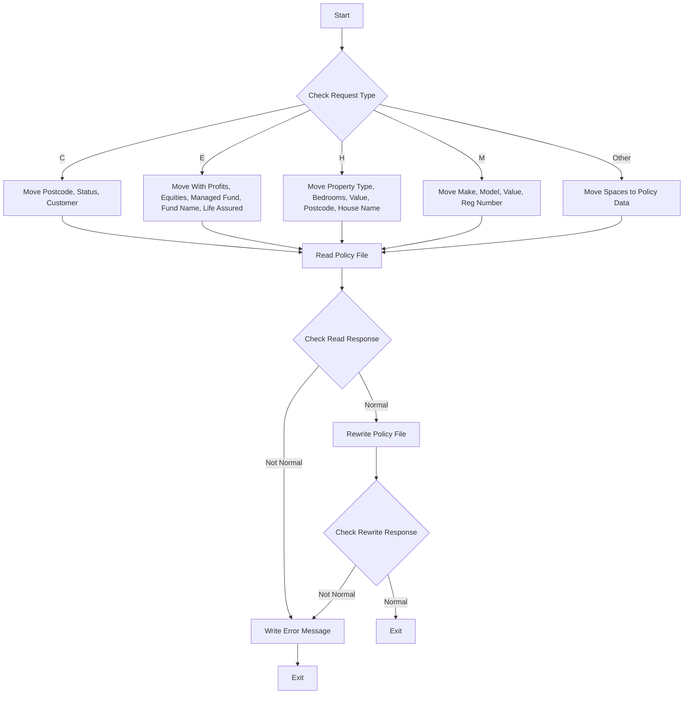

The <SwmToken path="base/src/lgupvs01.cbl" pos="11:6:6" line-data="       PROGRAM-ID. LGUPVS01.">`LGUPVS01`</SwmToken> program is responsible for updating policy information in the insurance application. It processes various types of requests by moving specific data from the communication area to working storage fields, reading the policy file, and rewriting it with updated information. The program ensures that any errors encountered during these operations are properly logged for further investigation.

The <SwmToken path="base/src/lgupvs01.cbl" pos="11:6:6" line-data="       PROGRAM-ID. LGUPVS01.">`LGUPVS01`</SwmToken> program updates policy information by first determining the type of request and moving relevant data to working storage fields. It then reads the policy file and, if successful, rewrites it with the updated information. If any errors occur during the read or rewrite operations, the program logs the errors for further investigation.

# Where is this program used?

This program is used once, in a flow starting from `lgupdb01` as represented in the following diagram:



Lets' zoom into the flow:



<SwmSnippet path="/base/src/lgupvs01.cbl" line="100">

---

## Initializing Variables

First, we move the length of the communication area to <SwmToken path="base/src/lgupvs01.cbl" pos="100:7:11" line-data="           Move EIBCALEN To WS-Commarea-Len.">`WS-Commarea-Len`</SwmToken>, and then we move the request ID, policy number, and customer number from the communication area to working storage fields. This sets up the necessary data for processing the request.

```cobol
           Move EIBCALEN To WS-Commarea-Len.
      *---------------------------------------------------------------*
           Move CA-Request-ID(4:1) To WF-Request-ID
           Move CA-Policy-Num      To WF-Policy-Num
           Move CA-Customer-Num    To WF-Customer-Num
```

---

</SwmSnippet>

<SwmSnippet path="/base/src/lgupvs01.cbl" line="106">

---

## Evaluating Request Type

Next, we evaluate the <SwmToken path="base/src/lgupvs01.cbl" pos="106:3:7" line-data="           Evaluate WF-Request-ID">`WF-Request-ID`</SwmToken> to determine the type of request. Depending on the request type ('C', 'E', 'H', 'M', or other), we move specific data from the communication area to working storage fields. This step ensures that the relevant data for the request type is available for further processing.

```cobol
           Evaluate WF-Request-ID

             When 'C'
               Move CA-B-Postcode  To WF-B-Postcode
               Move CA-B-Status    To WF-B-Status
               Move CA-B-Customer  To WF-B-Customer

             When 'E'
               Move CA-E-WITH-PROFITS To  WF-E-WITH-PROFITS
               Move CA-E-EQUITIES     To  WF-E-EQUITIES
               Move CA-E-MANAGED-FUND To  WF-E-MANAGED-FUND
               Move CA-E-FUND-NAME    To  WF-E-FUND-NAME
               Move CA-E-LIFE-ASSURED To  WF-E-LIFE-ASSURED

             When 'H'
               Move CA-H-PROPERTY-TYPE To  WF-H-PROPERTY-TYPE
               Move CA-H-BEDROOMS      To  WF-H-BEDROOMS
               Move CA-H-VALUE         To  WF-H-VALUE
               Move CA-H-POSTCODE      To  WF-H-POSTCODE
               Move CA-H-HOUSE-NAME    To  WF-H-HOUSE-NAME

```

---

</SwmSnippet>

<SwmSnippet path="/base/src/lgupvs01.cbl" line="139">

---

## Reading Policy File

Then, we read the policy file using the <SwmToken path="base/src/lgupvs01.cbl" pos="139:3:5" line-data="           Exec CICS Read File(&#39;KSDSPOLY&#39;)">`CICS Read`</SwmToken> command. If the read operation is not successful, we move the response code to <SwmToken path="base/src/lgupvs01.cbl" pos="148:7:9" line-data="             Move EIBRESP2 To WS-RESP2">`WS-RESP2`</SwmToken>, set the return code to '81', perform the <SwmToken path="base/src/lgupvs01.cbl" pos="150:3:7" line-data="             PERFORM WRITE-ERROR-MESSAGE">`WRITE-ERROR-MESSAGE`</SwmToken> routine, and abend the transaction with code <SwmToken path="base/src/lgupvs01.cbl" pos="151:10:10" line-data="             EXEC CICS ABEND ABCODE(&#39;LGV3&#39;) NODUMP END-EXEC">`LGV3`</SwmToken>. If the read operation is successful, we proceed to the next step.

```cobol
           Exec CICS Read File('KSDSPOLY')
                     Into(WS-FileIn)
                     Length(WS-Commarea-Len)
                     Ridfld(WF-Policy-Key)
                     KeyLength(21)
                     RESP(WS-RESP)
                     Update
           End-Exec.
           If WS-RESP Not = DFHRESP(NORMAL)
             Move EIBRESP2 To WS-RESP2
             MOVE '81' TO CA-RETURN-CODE
             PERFORM WRITE-ERROR-MESSAGE
             EXEC CICS ABEND ABCODE('LGV3') NODUMP END-EXEC
             EXEC CICS RETURN END-EXEC
           End-If.
```

---

</SwmSnippet>

<SwmSnippet path="/base/src/lgupvs01.cbl" line="155">

---

## Rewriting Policy File

Next, we rewrite the policy file with the updated policy information using the <SwmToken path="base/src/lgupvs01.cbl" pos="155:3:5" line-data="           Exec CICS ReWrite File(&#39;KSDSPOLY&#39;)">`CICS ReWrite`</SwmToken> command. If the rewrite operation is not successful, we move the response code to <SwmToken path="base/src/lgupvs01.cbl" pos="161:7:9" line-data="             Move EIBRESP2 To WS-RESP2">`WS-RESP2`</SwmToken>, set the return code to '82', perform the <SwmToken path="base/src/lgupvs01.cbl" pos="163:3:7" line-data="             PERFORM WRITE-ERROR-MESSAGE">`WRITE-ERROR-MESSAGE`</SwmToken> routine, and abend the transaction with code <SwmToken path="base/src/lgupvs01.cbl" pos="164:10:10" line-data="             EXEC CICS ABEND ABCODE(&#39;LGV4&#39;) NODUMP END-EXEC">`LGV4`</SwmToken>. If the rewrite operation is successful, we proceed to the exit.

```cobol
           Exec CICS ReWrite File('KSDSPOLY')
                     From(WF-Policy-Info)
                     Length(WS-Commarea-LenF)
                     RESP(WS-RESP)
           End-Exec.
           If WS-RESP Not = DFHRESP(NORMAL)
             Move EIBRESP2 To WS-RESP2
             MOVE '82' TO CA-RETURN-CODE
             PERFORM WRITE-ERROR-MESSAGE
             EXEC CICS ABEND ABCODE('LGV4') NODUMP END-EXEC
             EXEC CICS RETURN END-EXEC
           End-If.
```

---

</SwmSnippet>

<SwmSnippet path="/base/src/lgupvs01.cbl" line="174">

---

## Writing Error Message

If an error occurs during the read or rewrite operations, we perform the <SwmToken path="base/src/lgupvs01.cbl" pos="174:1:5" line-data="       WRITE-ERROR-MESSAGE.">`WRITE-ERROR-MESSAGE`</SwmToken> routine. This routine gets the current date and time, moves the customer number and response codes to the error message structure, and links to the <SwmToken path="base/src/lgupvs01.cbl" pos="187:10:10" line-data="           EXEC CICS LINK PROGRAM(&#39;LGSTSQ&#39;)">`LGSTSQ`</SwmToken> program to log the error message. This ensures that any errors are properly logged for further investigation.

More about LGSTSQ: <SwmLink doc-title="Handling Messages (LGSTSQ)">[Handling Messages (LGSTSQ)](/.swm/handling-messages-lgstsq.o6o7rslw.sw.md)</SwmLink>

```cobol
       WRITE-ERROR-MESSAGE.
           EXEC CICS ASKTIME ABSTIME(WS-ABSTIME)
           END-EXEC
           EXEC CICS FORMATTIME ABSTIME(WS-ABSTIME)
                     MMDDYYYY(WS-DATE)
                     TIME(WS-TIME)
           END-EXEC
      *
           MOVE WS-DATE TO EM-DATE
           MOVE WS-TIME TO EM-TIME
           Move CA-Customer-Num To EM-Cusnum
           Move WS-RESP         To EM-RespRC
           Move WS-RESP2        To EM-Resp2RC
           EXEC CICS LINK PROGRAM('LGSTSQ')
                     COMMAREA(ERROR-MSG)
                     LENGTH(LENGTH OF ERROR-MSG)
           END-EXEC.
           IF EIBCALEN > 0 THEN
             IF EIBCALEN < 91 THEN
               MOVE DFHCOMMAREA(1:EIBCALEN) TO CA-DATA
               EXEC CICS LINK PROGRAM('LGSTSQ')
```

---

</SwmSnippet>

&nbsp;

*This is an auto-generated document by Swimm 🌊 and has not yet been verified by a human*

<SwmMeta version="3.0.0" repo-id="Z2l0aHViJTNBJTNBa3luZHJ5bC1jaWNzLWdlbmFwcCUzQSUzQVN3aW1tLURlbW8=" repo-name="kyndryl-cics-genapp"><sup>Powered by [Swimm](/)</sup></SwmMeta>
