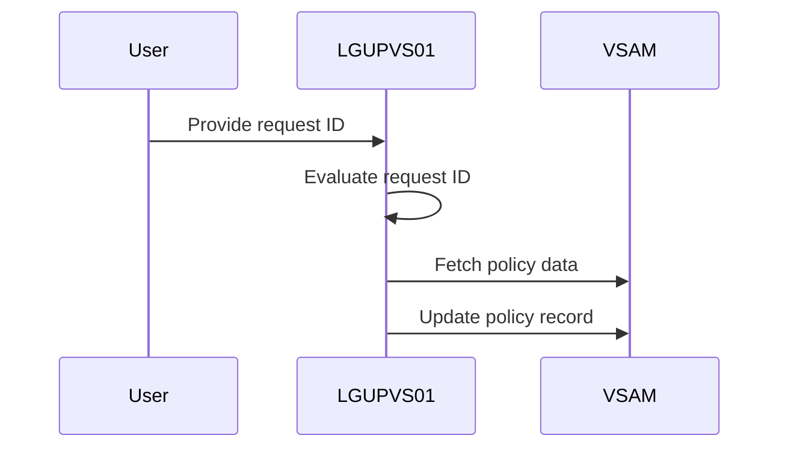
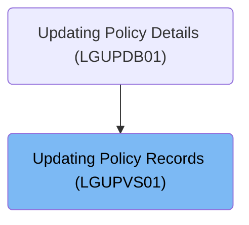

This document describes the process of updating policy records using the <SwmToken path="base/src/lgupvs01.cbl" pos="11:6:6" line-data="       PROGRAM-ID. LGUPVS01.">`LGUPVS01`</SwmToken> program. The program handles different types of policy data requests, such as customer, investment, property, and vehicle data, and updates the corresponding records in a VSAM KSDS file. For example, if the request ID is 'C', customer data such as postcode and status are processed and updated in the policy record.

The main steps are:

- Evaluate the request ID to determine the type of policy data to process
- Handle customer, investment, property, or vehicle data based on the request ID
- Update the policy record in the VSAM KSDS file



## Dependencies

### Program

- LGSTSQ (<SwmPath>[base/src/lgstsq.cbl](base/src/lgstsq.cbl)</SwmPath>) - <SwmLink doc-title="Message Queue Handler (LGSTSQ)">[Message Queue Handler (LGSTSQ)](/.swm/message-queue-handler-lgstsq.e7y8uelv.sw.md)</SwmLink>

### Copybook

- LGCMAREA (<SwmPath>[base/src/lgcmarea.cpy](base/src/lgcmarea.cpy)</SwmPath>)

# Where is this program used?

This program is used once, as represented in the following diagram:



# Initiating Policy Data Processing

<SwmSnippet path="/base/src/lgupvs01.cbl" line="97">

---

In <SwmToken path="base/src/lgupvs01.cbl" pos="97:1:1" line-data="       MAINLINE SECTION.">`MAINLINE`</SwmToken>, we start the flow by moving data from the communication area to working fields. The Evaluate statement checks the <SwmToken path="base/src/lgupvs01.cbl" pos="102:16:20" line-data="           Move CA-Request-ID(4:1) To WF-Request-ID">`WF-Request-ID`</SwmToken> to decide the type of policy data to process, similar to a switch-case in other languages.

```cobol
       MAINLINE SECTION.
      *
      *---------------------------------------------------------------*
           Move EIBCALEN To WS-Commarea-Len.
      *---------------------------------------------------------------*
           Move CA-Request-ID(4:1) To WF-Request-ID
           Move CA-Policy-Num      To WF-Policy-Num
           Move CA-Customer-Num    To WF-Customer-Num

           Evaluate WF-Request-ID
```

---

</SwmSnippet>

<SwmSnippet path="/base/src/lgupvs01.cbl" line="108">

---

When <SwmToken path="base/src/lgupvs01.cbl" pos="102:16:20" line-data="           Move CA-Request-ID(4:1) To WF-Request-ID">`WF-Request-ID`</SwmToken> is 'C', we handle customer data.

```cobol
             When 'C'
               Move CA-B-Postcode  To WF-B-Postcode
               Move CA-B-Status    To WF-B-Status
               Move CA-B-Customer  To WF-B-Customer
```

---

</SwmSnippet>

<SwmSnippet path="/base/src/lgupvs01.cbl" line="113">

---

When <SwmToken path="base/src/lgupvs01.cbl" pos="102:16:20" line-data="           Move CA-Request-ID(4:1) To WF-Request-ID">`WF-Request-ID`</SwmToken> is 'E', we handle investment data.

```cobol
             When 'E'
               Move CA-E-WITH-PROFITS To  WF-E-WITH-PROFITS
               Move CA-E-EQUITIES     To  WF-E-EQUITIES
               Move CA-E-MANAGED-FUND To  WF-E-MANAGED-FUND
               Move CA-E-FUND-NAME    To  WF-E-FUND-NAME
               Move CA-E-LIFE-ASSURED To  WF-E-LIFE-ASSURED
```

---

</SwmSnippet>

<SwmSnippet path="/base/src/lgupvs01.cbl" line="120">

---

When <SwmToken path="base/src/lgupvs01.cbl" pos="102:16:20" line-data="           Move CA-Request-ID(4:1) To WF-Request-ID">`WF-Request-ID`</SwmToken> is 'H', we handle property data.

```cobol
             When 'H'
               Move CA-H-PROPERTY-TYPE To  WF-H-PROPERTY-TYPE
               Move CA-H-BEDROOMS      To  WF-H-BEDROOMS
               Move CA-H-VALUE         To  WF-H-VALUE
               Move CA-H-POSTCODE      To  WF-H-POSTCODE
               Move CA-H-HOUSE-NAME    To  WF-H-HOUSE-NAME
```

---

</SwmSnippet>

<SwmSnippet path="/base/src/lgupvs01.cbl" line="127">

---

When <SwmToken path="base/src/lgupvs01.cbl" pos="102:16:20" line-data="           Move CA-Request-ID(4:1) To WF-Request-ID">`WF-Request-ID`</SwmToken> is 'M', we handle vehicle data.

```cobol
             When 'M'
               Move CA-M-MAKE          To  WF-M-MAKE
               Move CA-M-MODEL         To  WF-M-MODEL
               Move CA-M-VALUE         To  WF-M-VALUE
               Move CA-M-REGNUMBER     To  WF-M-REGNUMBER
```

---

</SwmSnippet>

<SwmSnippet path="/base/src/lgupvs01.cbl" line="133">

---

When <SwmToken path="base/src/lgupvs01.cbl" pos="102:16:20" line-data="           Move CA-Request-ID(4:1) To WF-Request-ID">`WF-Request-ID`</SwmToken> doesn't match any cases, spaces are moved to <SwmToken path="base/src/lgupvs01.cbl" pos="134:7:11" line-data="               Move Spaces To WF-Policy-Data">`WF-Policy-Data`</SwmToken>, clearing the fields.

```cobol
             When Other
               Move Spaces To WF-Policy-Data
           End-Evaluate
```

---

</SwmSnippet>

<SwmSnippet path="/base/src/lgupvs01.cbl" line="137">

---

The Exec CICS Read File command fetches policy data from the VSAM KSDS file using <SwmToken path="base/src/lgupvs01.cbl" pos="142:3:7" line-data="                     Ridfld(WF-Policy-Key)">`WF-Policy-Key`</SwmToken>, storing it in <SwmToken path="base/src/lgupvs01.cbl" pos="140:3:5" line-data="                     Into(WS-FileIn)">`WS-FileIn`</SwmToken>.

```cobol
           Move CA-Policy-Num      To WF-Policy-Num
      *---------------------------------------------------------------*
           Exec CICS Read File('KSDSPOLY')
                     Into(WS-FileIn)
                     Length(WS-Commarea-Len)
                     Ridfld(WF-Policy-Key)
                     KeyLength(21)
                     RESP(WS-RESP)
                     Update
           End-Exec.
```

---

</SwmSnippet>

<SwmSnippet path="/base/src/lgupvs01.cbl" line="155">

---

The Exec CICS <SwmToken path="base/src/lgupvs01.cbl" pos="155:5:5" line-data="           Exec CICS ReWrite File(&#39;KSDSPOLY&#39;)">`ReWrite`</SwmToken> File command updates the policy record in the VSAM KSDS file with data from <SwmToken path="base/src/lgupvs01.cbl" pos="156:3:7" line-data="                     From(WF-Policy-Info)">`WF-Policy-Info`</SwmToken>.

```cobol
           Exec CICS ReWrite File('KSDSPOLY')
                     From(WF-Policy-Info)
                     Length(WS-Commarea-LenF)
                     RESP(WS-RESP)
           End-Exec.
```

---

</SwmSnippet>

&nbsp;

*This is an auto-generated document by Swimm 🌊 and has not yet been verified by a human*

<SwmMeta version="3.0.0" repo-id="Z2l0aHViJTNBJTNBa3luZHJ5bC1jaWNzLWdlbmFwcCUzQSUzQVN3aW1tLURlbW8=" repo-name="kyndryl-cics-genapp"><sup>Powered by [Swimm](/)</sup></SwmMeta>
