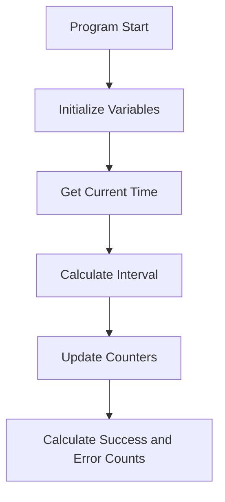

The <SwmToken path="base/src/lgwebst5.cbl" pos="11:6:6" line-data="       PROGRAM-ID. LGWEBST5">`LGWEBST5`</SwmToken> program is responsible for calculating transaction rates in the system. It achieves this by initializing variables, retrieving the current time, calculating time intervals, updating counters, and computing success and error counts.

The flow starts with initializing necessary variables and retrieving the current time. It then calculates the time interval between transactions, updates various counters, and finally computes success and error counts to provide insights into transaction performance.

Lets' zoom into the flow:



<SwmSnippet path="/base/src/lgwebst5.cbl" line="250">

---

## Initialize Variables

First, the program initializes the working storage header and moves transaction-related identifiers into working storage variables. This sets up the necessary context for the subsequent operations.

```cobol
       MAINLINE SECTION.
      *
           INITIALIZE WS-HEADER.

           MOVE EIBTRNID TO WS-TRANSID.
           MOVE EIBTRMID TO WS-TERMID.
           MOVE EIBTASKN TO WS-TASKNUM.
           MOVE EIBCALEN TO WS-CALEN.
      ****************************************************************
```

---

</SwmSnippet>

<SwmSnippet path="/base/src/lgwebst5.cbl" line="259">

---

## Get Current Time

Next, the program retrieves the current time using CICS commands and formats it into a readable date and time. This is essential for calculating the transaction rate intervals.

```cobol
           MOVE 'GENA'  To TSQpre
           EXEC CICS ASKTIME ABSTIME(WS-ABSTIME)
           END-EXEC
           EXEC CICS FORMATTIME ABSTIME(WS-ABSTIME)
                     MMDDYYYY(WS-DATE)
                     TIME(WS-TIME)
           END-EXEC
```

---

</SwmSnippet>

<SwmSnippet path="/base/src/lgwebst5.cbl" line="266">

---

## Calculate Interval

Then, the program performs the <SwmToken path="base/src/lgwebst5.cbl" pos="266:3:7" line-data="           Perform Tran-Rate-Interval">`Tran-Rate-Interval`</SwmToken> paragraph to calculate the time interval between transactions. This interval is used to determine the transaction rate.

```cobol
           Perform Tran-Rate-Interval
```

---

</SwmSnippet>

<SwmSnippet path="/base/src/lgwebst5.cbl" line="267">

---

## Update Counters

Moving to the next step, the program queries and updates various counters related to transaction rates. These counters are stored in temporary storage queues and are used to keep track of transaction statistics.

```cobol

           Exec CICS Query Counter(GENAcount)
                            Pool(GENApool)
                            Value(CountVal)
                            Resp(WS-RESP)
           End-Exec.
           Move CountVal  To GENAcount-V
           Move GENAcount-V  To S3
           String TSQpre,
                  'X05V' Delimited By Spaces
                  Into WS-TSQname
           Move S3           To NRateVal
           Perform Tran-Rate-Counts
```

---

</SwmSnippet>

<SwmSnippet path="/base/src/lgwebst5.cbl" line="280">

---

## Calculate Success and Error Counts

Finally, the program calculates the success and error counts by querying additional counters and performing computations. These counts provide insights into the performance and reliability of the transactions.

```cobol
      *
           Exec CICS Query Counter(GENACNT100)
                            Pool(GENApool)
                            Value(CountVal)
                            Resp(WS-RESP)
           End-Exec.
           Move CountVal  To CountSuccess
           Move CountVal  To CountInq
           Move CountVal  To GENACNT100-V
           Move GENACNT100-V To S3
           String TSQpre,
                  '100V' Delimited By Spaces
                  Into WS-TSQname
           Move S3           To NRateVal
           Perform Tran-Rate-Counts

           Exec CICS Query Counter(GENACNT199)
                            Pool(GENApool)
                            Value(CountVal)
                            Resp(WS-RESP)
           End-Exec.
```

---

</SwmSnippet>

<SwmSnippet path="/base/src/lgwebst5.cbl" line="715">

---

### <SwmToken path="base/src/lgwebst5.cbl" pos="715:1:5" line-data="       Tran-Rate-Interval.">`Tran-Rate-Interval`</SwmToken>

The <SwmToken path="base/src/lgwebst5.cbl" pos="715:1:5" line-data="       Tran-Rate-Interval.">`Tran-Rate-Interval`</SwmToken> paragraph calculates the time interval between transactions by reading and writing to temporary storage queues. It also schedules the next transaction to occur after a specified interval.

```cobol
       Tran-Rate-Interval.

           String TSQpre,
                  '000V' Delimited By Spaces
                  Into WS-TSQname
           Exec Cics ReadQ TS Queue(WS-TSQname)
                     Into(WS-OLDV)
                     Item(1)
                     Length(Length of WS-OLDV)
                     Resp(WS-RESP)
           End-Exec.
           If WS-RESP Not = DFHRESP(NORMAL)
            Move '120000' To WS-OLDV.

           Exec Cics DeleteQ TS Queue(WS-TSQNAME)
                     Resp(WS-RESP)
           End-Exec.

           Move WS-TIME   To WS-HHMMSS
           Exec Cics WRITEQ TS Queue(WS-TSQNAME)
                     FROM(WS-HHMMSS)
```

---

</SwmSnippet>

<SwmSnippet path="/base/src/lgwebst5.cbl" line="769">

---

### <SwmToken path="base/src/lgwebst5.cbl" pos="769:1:5" line-data="       Tran-Rate-Counts.">`Tran-Rate-Counts`</SwmToken>

The <SwmToken path="base/src/lgwebst5.cbl" pos="769:1:5" line-data="       Tran-Rate-Counts.">`Tran-Rate-Counts`</SwmToken> paragraph updates the transaction rate counters by reading, deleting, and writing to temporary storage queues. It computes the difference between the new and old rate values to determine the transaction rate.

```cobol
       Tran-Rate-Counts.

           Exec Cics ReadQ TS Queue(WS-TSQname)
                     Into(WS-TSQdata)
                     Item(1)
                     Length(Length of WS-TSQdata)
                     Resp(WS-RESP)
           End-Exec.
           Move WS-TSQdata  To ORateVal
           Exec Cics DeleteQ TS Queue(WS-TSQname)
                     Resp(WS-RESP)
           End-Exec.

           Move NRateVal  To WS-TSQdata
           Exec Cics WRITEQ TS Queue(WS-TSQname)
                     FROM(WS-TSQdata)
                     Length(Length of WS-TSQdata)
                     Resp(WS-RESP)
           End-Exec.
           Move ORateVal   To WS-TSQdata
           Exec Cics WRITEQ TS Queue(WS-TSQname)
```

---

</SwmSnippet>

&nbsp;

*This is an auto-generated document by Swimm 🌊 and has not yet been verified by a human*

<SwmMeta version="3.0.0" repo-id="Z2l0aHViJTNBJTNBa3luZHJ5bC1jaWNzLWdlbmFwcCUzQSUzQVN3aW1tLURlbW8=" repo-name="kyndryl-cics-genapp"><sup>Powered by [Swimm](/)</sup></SwmMeta>
