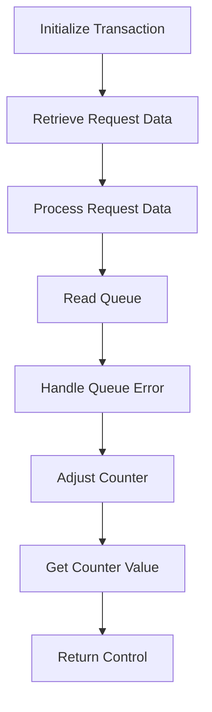

The <SwmToken path="base/src/lgastat1.cbl" pos="7:6:6" line-data="       PROGRAM-ID. LGASTAT1.">`LGASTAT1`</SwmToken> program is responsible for handling transaction processing in the system. It initializes the transaction, retrieves request data, processes the request, reads the transaction server queue, handles any queue errors, adjusts counter values, retrieves the counter value, and finally returns control to the calling program. This flow ensures that transaction data is correctly processed and managed within the system.

The <SwmToken path="base/src/lgastat1.cbl" pos="7:6:6" line-data="       PROGRAM-ID. LGASTAT1.">`LGASTAT1`</SwmToken> program starts by initializing the transaction with necessary IDs and task numbers. It then retrieves request data from containers and processes it based on response codes. The program reads the transaction server queue and handles any errors by updating time information. Counter values are adjusted as needed, and the counter value is retrieved for further use. Finally, control is returned to the calling program, completing the transaction processing.

Lets' zoom into the flow:



<SwmSnippet path="/base/src/lgastat1.cbl" line="69">

---

## Initialize Transaction

First, the transaction is initialized by moving various EIB fields to working storage fields. This sets up the transaction ID, terminal ID, task number, and call length for further processing.

```cobol
       MAINLINE SECTION.

      *
           INITIALIZE WS-HEADER.
      *
           MOVE EIBTRNID TO WS-TRANSID.
           MOVE EIBTRMID TO WS-TERMID.
           MOVE EIBTASKN TO WS-TASKNUM.
           MOVE EIBCALEN TO WS-CALEN.
```

---

</SwmSnippet>

<SwmSnippet path="/base/src/lgastat1.cbl" line="79">

---

## Retrieve Request Data

Next, the request data is retrieved from two containers using CICS Get Container commands. This data is stored in <SwmToken path="base/src/lgastat1.cbl" pos="80:3:7" line-data="                         Into(WS-Data-Req)">`WS-Data-Req`</SwmToken> and <SwmToken path="base/src/lgastat1.cbl" pos="85:3:7" line-data="                         Into(WS-Data-RC)">`WS-Data-RC`</SwmToken> for further processing.

```cobol
           Exec CICS Get Container(WS-CHANname1)
                         Into(WS-Data-Req)
                         Resp(WS-RESP)
           End-Exec.
      *
           Exec CICS Get Container(WS-CHANname2)
                         Into(WS-Data-RC)
                         Resp(WS-RESP)
           End-Exec.
```

---

</SwmSnippet>

<SwmSnippet path="/base/src/lgastat1.cbl" line="89">

---

## Process Request Data

Then, the response code is checked. If the response is normal, the request data is moved to <SwmToken path="base/src/lgastat1.cbl" pos="90:11:11" line-data="             Move WS-Data-REQ  To  GENACounter">`GENACounter`</SwmToken> and <SwmToken path="base/src/lgastat1.cbl" pos="91:11:11" line-data="             Move WS-Data-RC   To  GENAType">`GENAType`</SwmToken>. If not, it checks if the call length is zero and returns control if true. Otherwise, it moves default values to <SwmToken path="base/src/lgastat1.cbl" pos="96:11:11" line-data="               Move CA-REQUEST-ID  To GENAcounter">`GENAcounter`</SwmToken> and <SwmToken path="base/src/lgastat1.cbl" pos="97:11:11" line-data="               Move CA-RETURN-CODE To GENAtype">`GENAtype`</SwmToken>.

```cobol
           If WS-RESP = DFHRESP(NORMAL)
             Move WS-Data-REQ  To  GENACounter
             Move WS-Data-RC   To  GENAType
           Else
             IF EIBCALEN IS EQUAL TO ZERO
                 EXEC CICS RETURN END-EXEC
             Else
               Move CA-REQUEST-ID  To GENAcounter
               Move CA-RETURN-CODE To GENAtype
             End-if
           End-if.
```

---

</SwmSnippet>

<SwmSnippet path="/base/src/lgastat1.cbl" line="101">

---

## Read Queue

Next, the transaction server queue is read into <SwmToken path="base/src/lgastat1.cbl" pos="102:3:5" line-data="                     Into(WS-Qarea)">`WS-Qarea`</SwmToken>. This step is crucial for retrieving any queued data related to the transaction.

```cobol
           Exec Cics ReadQ TS Queue(WS-Qname)
                     Into(WS-Qarea)
                     Length(Length of WS-Qarea)
                     Resp(WS-RESP)
           End-Exec.
```

---

</SwmSnippet>

<SwmSnippet path="/base/src/lgastat1.cbl" line="106">

---

## Handle Queue Error

If there is a queue ID error, the current time is retrieved and formatted. This time is then moved to <SwmToken path="base/src/lgastat1.cbl" pos="113:9:13" line-data="             Move WS-Date To WS-area-D">`WS-area-D`</SwmToken> and <SwmToken path="base/src/lgastat1.cbl" pos="114:9:13" line-data="             Move WS-Time To WS-area-T">`WS-area-T`</SwmToken>, and the queue is written back with the updated time information.

```cobol
           If WS-RESP     = DFHRESP(QIDERR) Then
             EXEC CICS ASKTIME ABSTIME(WS-ABSTIME)
             END-EXEC
             EXEC CICS FORMATTIME ABSTIME(WS-ABSTIME)
                       DDMMYYYY(WS-DATE)
                       TIME(WS-TIME)
             END-EXEC
             Move WS-Date To WS-area-D
             Move WS-Time To WS-area-T
             Exec Cics WriteQ TS Queue(WS-Qname)
                       From(WS-Qarea)
                       Length(Length of WS-Qarea)
                       Resp(WS-RESP)
             End-Exec
           End-if
```

---

</SwmSnippet>

<SwmSnippet path="/base/src/lgastat1.cbl" line="122">

---

## Adjust Counter

Then, the counter values are adjusted based on specific conditions. For example, if <SwmToken path="base/src/lgastat1.cbl" pos="122:3:3" line-data="           If GENAcounter = &#39;02ACUS&#39;">`GENAcounter`</SwmToken> is <SwmToken path="base/src/lgastat1.cbl" pos="122:8:8" line-data="           If GENAcounter = &#39;02ACUS&#39;">`02ACUS`</SwmToken>, it is changed to <SwmToken path="base/src/lgastat1.cbl" pos="123:4:4" line-data="                                     Move &#39;01ACUS&#39; to GENAcounter.">`01ACUS`</SwmToken>. Similar adjustments are made for other counter values.

```cobol
           If GENAcounter = '02ACUS'
                                     Move '01ACUS' to GENAcounter.
           If GENAcounter = '02ICOM' or
              GENAcounter = '03ICOM' or
              GENAcounter = '05ICOM' Move '01ICOM' to GENAcounter.
           If GENAType Not = '00' Move '99' To GENAtype.
```

---

</SwmSnippet>

<SwmSnippet path="/base/src/lgastat1.cbl" line="129">

---

## Get Counter Value

Next, the counter value is retrieved using the CICS Get Counter command. This value is stored in <SwmToken path="base/src/lgastat1.cbl" pos="131:3:3" line-data="                             Value(Trancount)">`Trancount`</SwmToken> for further use.

```cobol
               Exec CICS Get Counter(GENAcount)
                             Pool(GENApool)
                             Value(Trancount)
                             Resp(WS-RESP)
               End-Exec
```

---

</SwmSnippet>

<SwmSnippet path="/base/src/lgastat1.cbl" line="135">

---

## Return Control

Finally, control is returned to the calling program, indicating the end of the transaction processing.

```cobol
           EXEC CICS RETURN END-EXEC.
```

---

</SwmSnippet>

&nbsp;

*This is an auto-generated document by Swimm 🌊 and has not yet been verified by a human*

<SwmMeta version="3.0.0" repo-id="Z2l0aHViJTNBJTNBa3luZHJ5bC1jaWNzLWdlbmFwcCUzQSUzQVN3aW1tLURlbW8=" repo-name="kyndryl-cics-genapp"><sup>Powered by [Swimm](/)</sup></SwmMeta>
